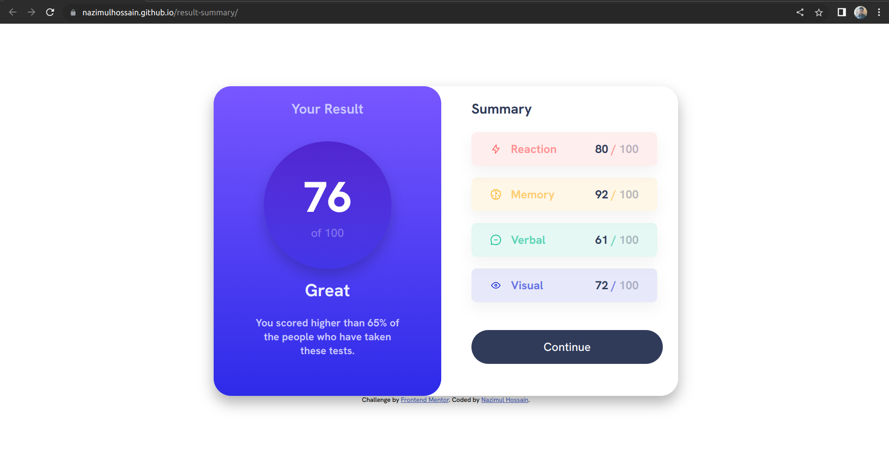
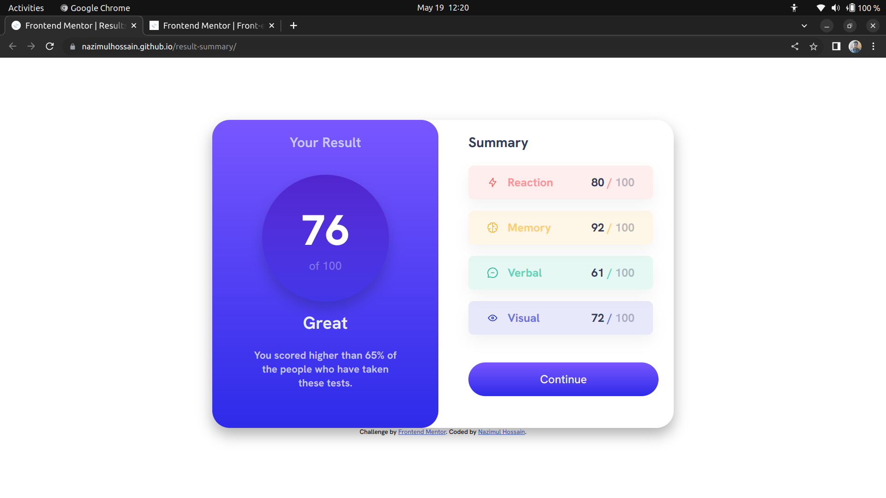
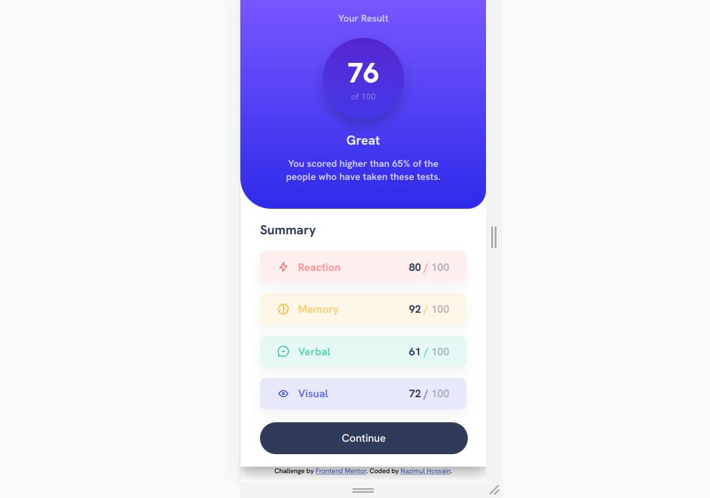

# Frontend Mentor - Results summary component solution

This is a solution to the [Results summary component challenge on Frontend Mentor](https://www.frontendmentor.io/challenges/results-summary-component-CE_K6s0maV). Frontend Mentor challenges help you improve your coding skills by building realistic projects.

## Table of contents

- [Overview](#overview)
  - [The challenge](#the-challenge)
  - [Screenshot](#screenshot)
  - [Links](#links)
- [My process](#my-process)
  - [Built with](#built-with)
  - [What I learned](#what-i-learned)
- [Author](#author)

## Overview

### The challenge

Users should be able to:

- View the optimal layout for the interface depending on their device's screen size
- See hover and focus states for all interactive elements on the page

### Screenshot

- Desktop Design



- Active State



- Mobile Design



### Links

- Solution URL: https://github.com/nazimulhossain/result-summary
- Live Site URL: https://nazimulhossain.github.io/result-summary/

## My process

### Built with

- Semantic HTML5 markup
- CSS custom properties
- Flexbox
- CSS Grid
- Desktop-first workflow
- Javascript

### What I learned

How to make a div container circle using border radius.

To see how you can add code snippets, see below:

```css
.proud-of-this-css {
  width: 22rem;
  height: 22rem;
  border-radius: 50%;
}
```

## Author

- Frontend Mentor - [@yourusername](https://www.frontendmentor.io/profile/nazimulhossain)
